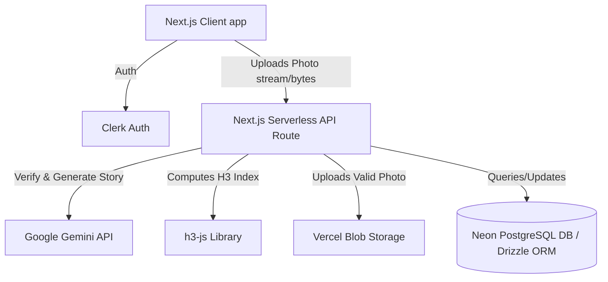

# Product Requirement Document (PRD): Gray Duck (v0 MVP)

**Project Name**: Gray Duck (short for Duck Duck Gray Duck)  
**Description**: A real-world animal discovery game (similar to Pokémon Go, but for real animals encountered in nature) powered by the Google Gemini API.  
**Tech Stack**: Next.js (TypeScript), Vercel, Neon Postgres, Drizzle ORM, Clerk, Vercel Blob, Uber H3, Google Maps JavaScript API.

---

## 1. Executive Summary & Vision
Gray Duck encourages users to explore their real-world surroundings and catalog the animals they encounter. By taking photos of local wildlife (squirrels, ducks, rabbits, birds), users discover unique, AI-named animals with generated backstories. 

To keep the game grounded in reality, geographic areas ("zones") have carrying capacities (saturation points) for different species. Once a zone is saturated, new photos of a species will match to a previously discovered animal in that zone instead of generating a new one, letting users "interact" with local animal residents.

---

## 2. Core v0 MVP Feature Scope
To get the bare minimum app off the ground, the v0 scope includes:
1. **Interactive Map Interface**: A map showing animal discoveries. Markers are grouped using clustering.
2. **Camera & Capture Flow**: A web-based camera interface that captures photos along with the user's GPS coordinates.
3. **AI Species Verification & Metadata Generation**: Utilizing the Google Gemini API to analyze the photo, verify if it's an animal, determine the species, and generate a creative name and backstory.
4. **H3 Hexagonal Zone Indexing**: Partitioning the globe into spatial cells using the Uber H3 grid system.
5. **Flexible Animal Matching Service**: An isolated service layer that decides whether a photo constitutes a "new discovery" or an "encounter with an existing animal" based on saturation limits and geographic proximity.
6. **Clerk Authentication**: User signup/login to track personal discoveries and associate usernames with animal discoverers.
7. **Discovery Journal (Pokédex)**: A profile/journal view where players see their unique discoveries and list of encountered animals.

---

## 3. Architecture & Tech Stack



### Key Technical Specs:
- **Framework**: Next.js App Router (TypeScript).
- **Deployment**: Vercel.
- **Database**: Neon Serverless Postgres.
- **ORM**: Drizzle ORM for serverless Postgres.
- **Auth**: Clerk (lazy synced into Postgres cache during authenticated API requests).
- **Storage**: Vercel Blob for storing verified animal photos (uploaded server-side after Gemini verification).
- **Geospatial Mapping**: `h3-js` to compute resolution 9 hexagons (~0.1 square km) from latitude/longitude, and to look up adjacent cells (1-ring radius, total 7 cells).
- **Map View**: Google Maps JavaScript API (via `@vis.gl/react-google-maps`) utilizing markers and marker clustering.

---

## 4. Database Schema Design (Drizzle ORM)

```typescript
import { pgTable, uuid, varchar, doublePrecision, timestamp, text } from 'drizzle-orm/pg-core';

// 1. Users Table (clerk cached profile data)
export const users = pgTable('users', {
  id: varchar('id', { length: 255 }).primaryKey(), // Matches Clerk User ID
  username: varchar('username', { length: 255 }).notNull(),
  avatarUrl: varchar('avatar_url', { length: 1024 }),
  createdAt: timestamp('created_at').defaultNow().notNull(),
});

// 2. Animals Table (Unique discoveries)
export const animals = pgTable('animals', {
  id: uuid('id').defaultRandom().primaryKey(),
  name: varchar('name', { length: 255 }).notNull(), // AI Generated, e.g. "Charles"
  species: varchar('species', { length: 255 }).notNull(), // Normalized species name, e.g. "squirrel"
  backstory: text('backstory').notNull(), // AI Generated backstory
  photoUrl: varchar('photo_url', { length: 1024 }).notNull(), // Vercel Blob URL
  discovererId: varchar('discoverer_id', { length: 255 })
    .references(() => users.id, { onDelete: 'cascade' })
    .notNull(),
  h3Index: varchar('h3_index', { length: 32 }).notNull(), // Uber H3 Resolution 9 index (expanded length for safety margin)
  latitude: doublePrecision('latitude').notNull(), // Exact location of discovery
  longitude: doublePrecision('longitude').notNull(), // Exact location of discovery
  createdAt: timestamp('created_at').defaultNow().notNull(),
});

// 3. Encounters Table (Tracks players sighting these animals. Note: every new discovery automatically creates an encounter for the discoverer)
export const encounters = pgTable('encounters', {
  id: uuid('id').defaultRandom().primaryKey(),
  userId: varchar('user_id', { length: 255 })
    .references(() => users.id, { onDelete: 'cascade' })
    .notNull(),
  animalId: uuid('animal_id')
    .references(() => animals.id, { onDelete: 'cascade' })
    .notNull(),
  photoUrl: varchar('photo_url', { length: 1024 }).notNull(), // Photo taken during this specific encounter
  createdAt: timestamp('created_at').defaultNow().notNull(),
});
```

---

## 5. Flexible Animal Matching Architecture

To make the app feel realistic, we need a flexible matching layer. The algorithm will start simple (GPS proximity within an H3 cell) but must be designed to swap out for advanced visual embedding or Gemini-based visual matching in the future.

### Code Abstraction Strategy
All matching logic must be isolated in a dedicated service module: `/services/matching/`.

We define a standard signature for the matcher:

```typescript
export interface MatchingResult {
  isNewDiscovery: boolean;
  matchedAnimal: typeof animals.$inferSelect | null;
}

export interface MatchingParams {
  userId: string;
  species: string; // e.g., "squirrel"
  latitude: number;
  longitude: number;
  h3Index: string;
  photoUrl: string;
  existingAnimalsInZone: (typeof animals.$inferSelect)[];
}

export interface AnimalMatchingStrategy {
  match(params: MatchingParams): Promise<MatchingResult>;
}
```

### Initial v0 Strategy: `ProximityMatchingStrategy`
1. Define the user's active zone as their current H3 cell plus its 6 adjacent neighbors (1-ring radius, total of 7 cells computed using `gridDisk(h3Index, 1)`).
2. Query `existingAnimalsInZone` across these 7 H3 cells for the specified `species` (after Gemini results are normalized to lowercase canonical names like `squirrel`, `duck`, `rabbit`, `goose`, `bird`, `other`).
3. **If count < Saturation Limit** (configured per species in `/services/matching/config.ts`, defaulting to 3 for undefined species):
   - Return `{ isNewDiscovery: true, matchedAnimal: null }`.
4. **If count >= Saturation Limit**:
   - Find the animal of that species in the 7-cell neighborhood that is **geographically closest** to the user's current `(latitude, longitude)`.
   - Return `{ isNewDiscovery: false, matchedAnimal: closestAnimal }`.

### Future Swappable Strategies (Planned)
- **`GeminiVisualMatcher`**: Send the user's photo and the photos/stories of existing animals in the zone to Gemini. Ask: *"Is the animal in Photo A most likely the same individual as in Photo B, C, or D?"*
- **`EmbeddingMatcher`**: Compare vector embeddings of the animal photos using a lightweight image embedding model.

---

## 6. Verification & Testing Requirements
- **Unit Tests**:
  - `h3-js` resolution 9 index computations.
  - Saturation logic boundaries (under capacity vs. at capacity).
  - Proximity calculation correctness (finding the closest animal).
- **Integration Tests**:
  - Mock Gemini API response formats for photo analysis.
  - Database schema constraints and transaction handling for new discoveries vs. encounters.

---

## 7. Next Steps & Scope of Issues
Following this PRD, the initial backlog will be divided into the following implementation tickets:
1. **[Issue 1] DB & Auth Boilerplate**: Setup Drizzle ORM, database connection pools to Neon, and build a helper/middleware for Clerk lazy auth user profile syncing.
2. **[Issue 2] Matching Engine & H3 Index Service**: Implement the isolated `MatchingService` with `ProximityMatchingStrategy` (querying the center H3 cell and its 6 neighbors) and unit tests.
3. **[Issue 3] Gemini API Pipeline**: Create an API route that parses multipart image uploads, verifies the animal via Gemini API (utilizing JSON schema outputs), and if valid, uploads the image to Vercel Blob, invokes matching logic, and writes database records (auto-creating both the animal and encounter).
4. **[Issue 4] Map Dashboard (v0 UI)**: React Map implementation utilizing user geolocation, markers, and clustering, querying only markers within the viewport bounds.
5. **[Issue 5] Journal & Encounter UI**: Build the user profile, list view of encountered animals (derived from the `encounters` table), and detailed animal cards.
